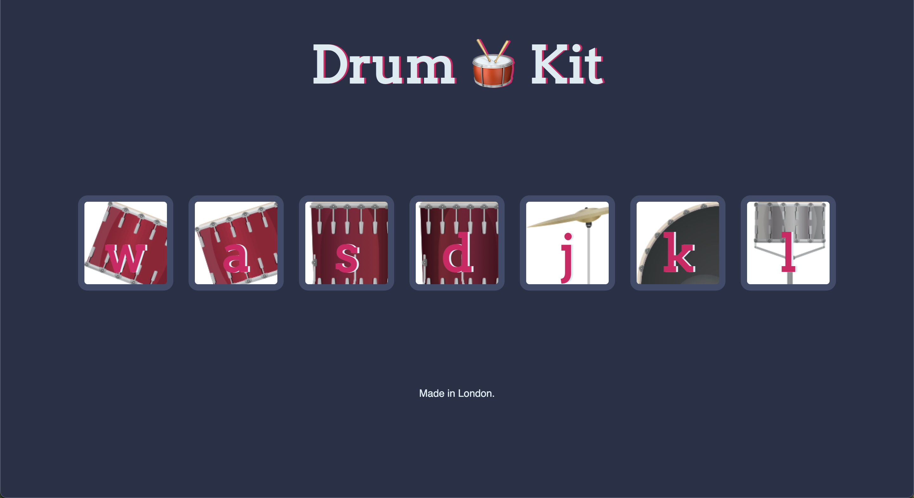

# Learning advanced JavaScript and DOM Manipulation.

Leraning outcomes : Add event listiners to button and keystrokes so that you'll know when the user is tapping on the keyboard or clicking
a particular button on website and user can respond to it.

# Screenshot

# Live site URL

https://sanjayvjacob.github.io/Drum-Kit/
